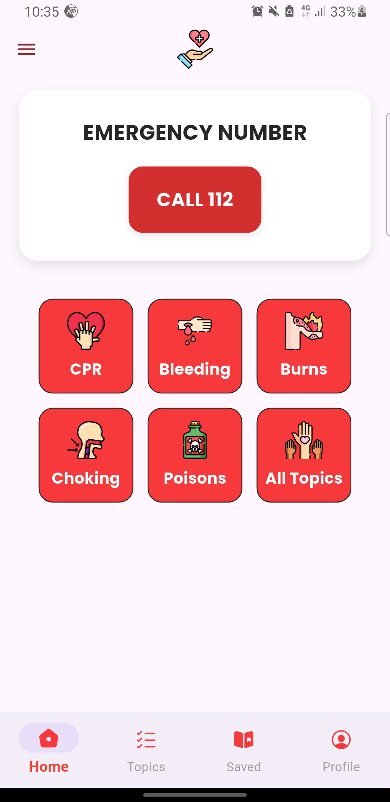
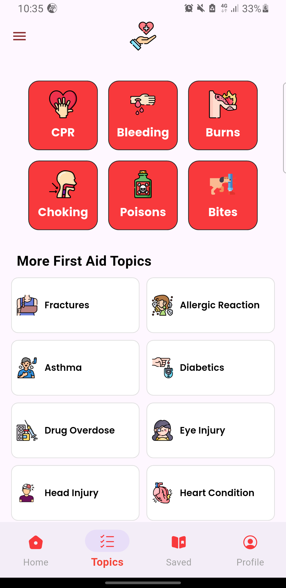
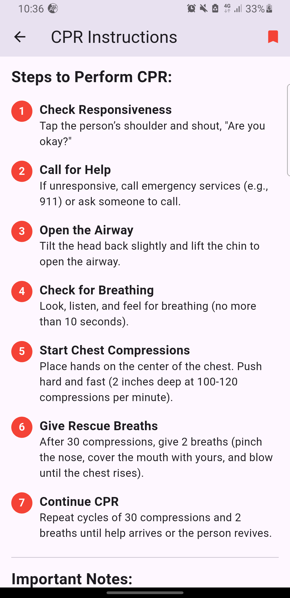

Here's an improved, more professional version of your README with better formatting and organization:

```markdown
# 🚑 First Aid Emergency Guide

[](https://flutter.dev)
[](https://opensource.org/licenses/MIT)
[](https://github.com/yvhiku/pgu-first-aid-app/stargazers)

A comprehensive first aid reference application providing immediate guidance for emergency medical situations.


## ✨ Key Features

### 🆘 Emergency Protocols
- Step-by-step visual guides for:
  - **CPR** (Adult/Child/Infant variations)
  - **Severe bleeding control** (Tourniquet usage)
  - **Burn treatment** (1st-3rd degree)
  - **Choking relief** (Heimlich maneuver)
  - **Poison management** (Ingestion/Inhalation)
  - +12 other critical first aid scenarios

### 🎯 Quick Access
- Color-coded emergency categories
- Life-saving instructions available in <3 taps
- Last-viewed topic memory

### 📚 Knowledge Base
- Illustrated anatomical diagrams
- Dos/Don'ts for each procedure
- Estimated procedure times
- Equipment requirements

### ⚙️ Technical Features
- Offline-capable saved topics
- Adaptive layout (phones/tablets)
- Dark/Light mode support
- Multilingual ready (i18n)

## 🚀 Getting Started

### Prerequisites
- Flutter SDK (>=3.19.0)
- Dart (>=3.3.0)
- Android Studio/Xcode (for emulators)

### Installation
```bash
# Clone repository
git clone https://github.com/yvhiku/pgu-first-aid-app.git
cd pgu-first-aid-app

# Install dependencies
flutter pub get

# Run app (choose your device)
flutter run
```

## 🛠 Technical Architecture

| Layer              | Technology             | Key Packages           |
|--------------------|------------------------|------------------------|
| **Framework**      | Flutter 3.19           | flutter/material       |
| **State Mgmt**     | GetX 4.6.5             | get, get_storage       |
| **Persistence**    | SharedPreferences 2.2.2| shared_preferences     |
| **UI Components**  | Material Design 3      | flutter_svg, lottie    |
| **Dev Tools**      | Dart 3.3               | flutter_lints          |

## 🗂 Project Structure

```
lib/
├── src/
│   ├── constants/          # App-wide constants
│   │   ├── app_colors.dart
│   │   ├── asset_paths.dart
│   │   └── string_keys.dart
│   │
│   ├── features/           # Feature modules
│   │   ├── core/           # Primary features
│   │   │   ├── controllers/  # Business logic
│   │   │   │   ├── topic_controller.dart
│   │   │   │   └── nav_controller.dart
│   │   │   │
│   │   │   ├── screens/      # UI pages
│   │   │   │   ├── home_screen.dart
│   │   │   │   ├── cpr_screen.dart
│   │   │   │   └── ...
│   │   │   │
│   │   │   └── widgets/     # Reusable components
│   │   │       ├── emergency_card.dart
│   │   │       └── step_indicator.dart
│   │   │
│   │   └── auth/           # Auth module (future)
│   │
│   ├── repository/         # Data layer
│   │   └── topic_repo.dart
│   │
│   └── utils/             # Utilities
│       ├── helpers.dart
│       └── dimensions.dart
│
├── main.dart              # App entry point
└── app.dart               # Root widget
```

## 📱 Screenshots

<div align="center">
  
   
  
</div>

## 🤝 How to Contribute

We welcome community contributions! Here's how to help:

1. **Report Issues**  
   Found a bug? [Open an issue](https://github.com/yvhiku/pgu-first-aid-app/issues)

2. **Suggest Improvements**  
   Propose new features via GitHub Discussions

3. **Code Contributions**  
   ```bash
   # 1. Fork the repository
   # 2. Create your feature branch
   git checkout -b feat/your-feature
   
   # 3. Commit changes
   git commit -m "feat: add your feature"
   
   # 4. Push to branch
   git push origin feat/your-feature
   
   # 5. Open a Pull Request
   ```

4. **Translation Help**  
   Help localize the app by contributing translations

## 📜 License

This project is licensed under the MIT License - see the [LICENSE](LICENSE) file for details.

## 📬 Contact

**Project Maintainer**: Fikri Mohamed  
**Email**: [yvhiku@yandex.ru](mailto:yvhiku@yandex.ru)  
**Project Link**: [https://github.com/yvhiku/pgu-first-aid-app](https://github.com/yvhiku/pgu-first-aid-app)

---

<div align="center">
  <sub>Built with ❤️ and Flutter</sub>
</div>
```
